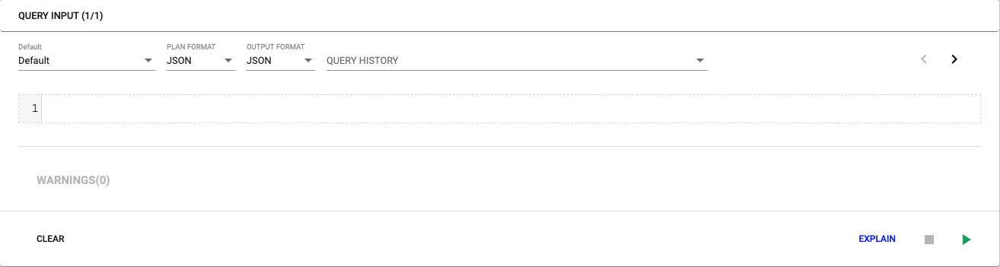
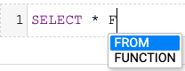
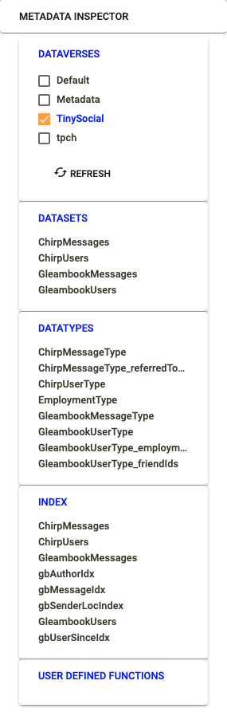
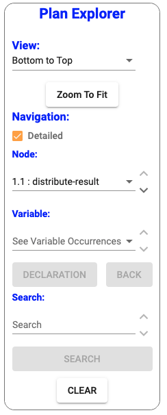
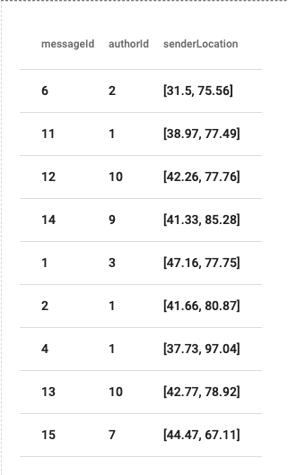

<!--
 ! Licensed to the Apache Software Foundation (ASF) under one
 ! or more contributor license agreements.  See the NOTICE file
 ! distributed with this work for additional information
 ! regarding copyright ownership.  The ASF licenses this file
 ! to you under the Apache License, Version 2.0 (the
 ! "License"); you may not use this file except in compliance
 ! with the License.  You may obtain a copy of the License at
 !
 !   http://www.apache.org/licenses/LICENSE-2.0
 !
 ! Unless required by applicable law or agreed to in writing,
 ! software distributed under the License is distributed on an
 ! "AS IS" BASIS, WITHOUT WARRANTIES OR CONDITIONS OF ANY
 ! KIND, either express or implied.  See the License for the
 ! specific language governing permissions and limitations
 ! under the License.
 !-->
 
 # AsterixDB Administration Console #
 
 ## <a id="toc">Table of Contents</a>
 
 * [Basics](#basics)
 * [Query Navigation](#qnav)
 * [Metadata Inspector](#metadatainspector)
 * [Interactive Plan Viewer](#planviewer)
 * [Exporting Data](#exporting)
 * [Development](#development)
 
## <a id="basics">Basic Usage</a> <a href="#toc">[Back to TOC]</a>

Executing a query is easy. Type your query into the query input box, select your run configurations, and then click the 
green play button to run the query. The output will appear below in the “Output” section.

__Input Options__

* `Dataverse` -   the dataverse that the query will use. The default is the `Default` dataverse. 
This input is not required and can be autodetected by running the query (see Figure 1). 
* `Output Format` - specifies the format of the result of the query.
    * `JSON` (default) - query results are returned in JSON. Viewable in “Tree” and “Table” mode.
    * `CSV (no header)` - query results are returned in CSV format without the header. Viewable only in “Table” mode.
    * `CSV (header)` -  query results are returned in CSV format with the header. Viewable only in “Table” mode. 
    See the [Exporting Data](#exporting) section for more information and examples.
* `Plan Format` -  specifies the format of the query plan (if requested). 
    * `JSON` (default) - results in showing the interactive query plan viewer.
    * `STRING` - results in the text / string format of the query plan. Equivalent to the text format from the legacy 19001 console.

To execute the query, click the green triangle in the bottom right of the query input section. 
Users may also choose to click the “Explain” button. This option will not actually run the query. 
It will return only the query plan instead. The console will default the view in the output section to “Plan” as well.

To cancel the query, click the red stop button in the bottom right of the query input section. 
This will send a “DELETE” request to the server and cancel the previous request.

\
Figure 1: The input component of the console

The dashboard also now supports autocomplete of SQL++ keywords. Use `CTRL+Space` to activate the autocomplete feature (see Figure 2). 

\
Figure 2: Example of autocomplete

## <a id="qnav">Query Navigation</a> <a href="#toc">[Back to TOC]</a>

This console supports query history and has two different ways of navigating the query history. On the input bar there 
is a section for `QUERY HISTORY` and there are also two arrows (`<` and `>`).

Utilizing the arrows will let you traverse all previously run queries one by one. However, if the console is already at 
the most recent query in the history and the user clicks the `>` or forward arrow, it will create a new empty query.

The `QUERY HISTORY` drop down allows users to jump to a specific query in the history without having to step through it with the arrows.

When executing a query, this query will be counted as a new query if it is different 
(comparison is purely based on the query text, not the results) from the most recent query. 
It will subsequently be added to the front of the query history.

## <a id="metadatainspector">Metadata Inspector</a> <a href="#toc">[Back to TOC]</a>

The metadata inspector is the column on the right side of the console (see Figure 3). The `Refresh` button is used to 
update the current metadata. When a user creates or drops a dataverse, dataset, datatype, user-defined function, or index, 
the changes will not be automatically reflected. The user must click the `Refresh` button to get the most up to date metadata.

\
Figure 3: The metadata inspector

The console supports multiple dialogs/windows open at once. All of these are resizable and draggable as well.

Users can also click the `JSON` / `SUMMARY` button in the dialog windows to toggle between the raw and parsed views of 
the metadata objects. `SUMMARY` is the default.

#### Dataverse

Clicking a dataverse will add it to the shown metadata in the inspector. Users can easily see which dataverses are 
currently being shown by the check mark to the left of the dataverse name. Users can select as many dataverses as desired. 
The datasets, datatypes, indices, and user-defined functions that are contained in the selected dataverses will appear 
in their corresponding sections.

#### Datasets

Clicking on a dataset will open a draggable and expandable window that contains information about the dataset.

* `Dataverse` - which dataverse the dataset belongs to.
* `Dataset` - the name of the dataset.
* `Datatype Name` - the name of the datatype of the dataset.
* `Primary Keys` - the primary keys of the dataset.
* `Sample` - if there is data inserted into the dataset, this is a section where viewers can see a sample of the dataset.
It is equivalent to the user querying: `SELECT * FROM {dataset} LIMIT 1`.

#### Datatypes

Clicking on a datatype will open a draggable and expandable window that contains information about the datatype. 
The console includes support for nested datatypes.

* `Dataverse` - which dataverse the datatype belongs to.
* `Datatype Name` - the name of the datatype.
* `Fields` - a list of the fields in the dataset. Each field has information on whether it is nullable or required. If 
the field is nested (not a primitive type), click on it to see the information about that type. If the field is wrapped 
in `[...]` or `{{...}}`, then it is an ordered list or unordered list respectively. If a field is italicized, it means 
it is an anonymous type.

NOTE: the `JSON` view does not support nested like the `SUMMARY` view does.

#### Index

Clicking on a dataset will open a draggable and expandable window that contains information about the index.

* `Dataverse` - which dataverse the index belongs to.
* `Index Name` - the name of the index.
* `Index Type` - the type of the index (primary or not primary).
* `Search Key(s)` - the key(s) of the index.

#### User-Defined Functions

Clicking on an user-defined function will open a draggable and expandable window that contains information about the 
user-defined function.

* `Dataverse` - which dataverse the user defined function (UDF) belongs to
* `Function Name` - the name of the UDF
* `Arity` - the number of parameters of the UDF
* `Parameters` - the name of the parameters
* `Definition` - the definition of the UDF

## <a id="planviewer">Interactive Plan Viewer</a> <a href="#toc">[Back to TOC]</a>

To view the interactive plan viewer, either execute a query and switch to the `PLAN` tab in the output section or `EXPLAIN` 
the query and it will default to the `PLAN` view.

To interact with the query plan, drag to move around the graph. Users can also choose to utilize the scroll function to 
zoom in and out of the plan. To the left of the plan will be the `Plan Explorer` (see Figure 5). This is the main way that users will 
be able to interact with the plan.

The plan orientation can be changed with the `Plan Explorer` under the `View` title. The default is 
`bottom to top`, but it can be swapped to `top to bottom` if desired.

The default view of the plan is not detailed (just showing operator IDs and operator names). To look at a more detailed 
view of the plan, check the `Detailed` checkbox in the plan explorer and the plan will reload with more detail per node.

\
Figure 5: The plan explorer

#### Traversing

There are two main ways to traverse the query plan. The dropdown under `Node` will display the node the user is currently at. 
This dropdown will keep track of the node the user is at throughout.

The arrows next to the dropdown can be used to step through the plan node by node in a Depth First Search (DFS) fashion.

Selecting a node from the dropdown will jump the viewer to the node in the plan that was selected. 

Utilizing both the dropdown and arrows, it is easy to trace through an entire plan.

#### Variables (Detailed mode only)

Under the `Variable` section of the `Plan Explorer`, there is a dropdown that will contain all the variables that occur 
in the plan. Selecting a variable there will jump the plan viewer to the node that contains the last (top-most in the plan) 
occurrence of that variable. The user can see how many occurrences there are via the `Variable Occurrences` title above the dropdown. 
The arrows to the right can be used to step through the occurrences.

To skip to the variable’s declaration, click the `DECLARATION` button. This will jump the plan viewer to the node of the 
very first occurrence of that variable. To get back to the previous node, click `BACK`.

#### Search (Detailed mode only)

Use the `Search` bar to type in a string of interest. The plan explorer will search the plan for that specific string in 
each node. The number of matches will be displayed in the title above the search bar. Users can use the arrows to the 
right to step through the nodes that matched. 

Users must click `Clear` after finishing with a search.

Unfortunately, at this time, regular expression search is not supported.

#### Clear

Clicking `Clear` will reset the query plan graph and focus the viewer on the first node in the plan.

## <a id="exporting">Exporting Data</a> <a href="#toc">[Back to TOC]</a>

Exporting data is a key part of the console’s functionality. Users can select from JSON, JSONL, CSV (no header), 
and CSV (header) as data types for the output.

### JSON/JSONL:

1. Select `JSON` on the input `Output Format` option and run the query that you want to export the results of
2. Click `Export` in the output section
3. Select between `JSON` and `JSONL` (JSON Lines) and adjust the filename to the desired name
4. Click `Export` to start the download

### CSV (no header):

1. Select `CSV (no header)` on the input `Output Format` option and run the query that you want to export the results of
2. Click `Export` in the output section
3. Adjust the filename to the desired name
4. Click `Export` to start the download

### CSV (header):

1. Create a datatype that supports the query you want to run
2. Set the `output-record-type` to this type before your query
3. Select `CSV (no header)` on the input `Output Format` option and run the query that you want to export the results of
4. Click `Export` in the output section
5. Adjust the filename to the desired name
6. Click `Export` to start the download

This one is clearly a little more involved. In order to get the desired header in the CSV format, it is necessary to 
set an `output-record-type` for the query. To better illustrate how to control this format, here is an example using the 
TinySocial dataset from the “Using SQL++” AsterixDB primer.

For context, here’s the GleambookMessages DDL statement.

    CREATE TYPE GleambookMessageType AS {
        messageId: int,
        authorId: int,
        inResponseTo: int?,
        senderLocation: point?,
        message: string
    };

    CREATE DATASET GleambookMessages(GleambookMessageType)
        PRIMARY KEY messageId;

First, create the type of the expected output. If the goal is to export `messageId`, `authorId`, and `senderLocation` in 
CSV format with headers, create an additional type to support this export. 

    CREATE TYPE GleambookMessages_exportCSV AS {
        messageId: int,
        authorId: int,
        senderLocation: point
    };
    
The query should then look something like this:
    
    USE TinySocial;
    
    SET `output-record-type` "GleambookMessages_exportCSV";
    
    SELECT messageId, authorId, senderLocation
    FROM GleambookMessages;
    
Now run the query with the `CSV (header)` input option and the result will contain the header `messageId`, `authorId`, 
and `senderLocation` (see Figure 5).

\
Figure 5: CSV (header) sample output

## <a id="development">Development</a> <a href="#toc">[Back to TOC]</a>

To start the development server, run `ng serve` or `npm start`. Navigate to `http://localhost:4200/`. 
The app will automatically reload if you change any of the source files.

To add a debugger, add a new `Javascrip Debug` configuration in the IntelliJ `Run Configurations` and set the URL to
`http://localhost:4200/`. Additionally, you can set the file directory to asterix-dashboard.